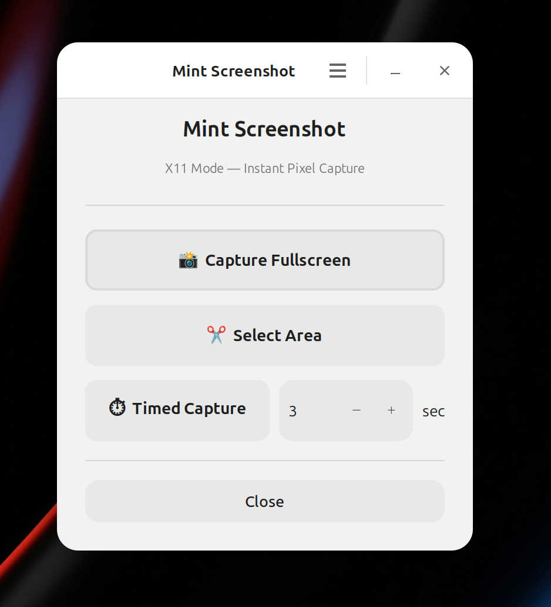
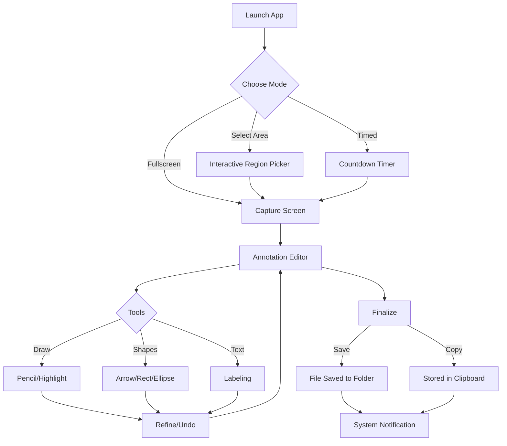
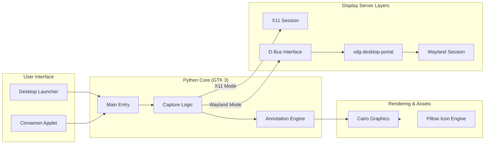

# 📸 Mint Screenshot

[](https://www.gnu.org/licenses/gpl-3.0)

**Mint Screenshot** is a feature-rich screenshot and annotation tool. While it was initially born as a dedicated applet for the **Cinnamon Desktop**, it has evolved into a versatile, distribution-agnostic tool that works flawlessly on GNOME, KDE, XFCE, and more.



---

## 🛠 How it Works

The tool provides a streamlined pipeline from the moment you decide to capture until the moment you share.



### 🏗 System Architecture

The application is built on a modular architecture that adapts to your system's display server.




---

## 🌟 Key Features

- **Cross-Platform Compatibility**: Fully supports both **X11** and **Wayland** (via `xdg-desktop-portal`).
- **Multiple Capture Modes**: Fullscreen, interactive region selection, and custom timed captures.
- **Rich Annotation Suite**:
  - **Precision Shapes**: Rectangles, Ellipses, and Arrows with adjustable thickness.
  - **Creative Tools**: Freehand drawing and highlighting.
  - **Text Tool**: Add labels and comments with ease.
- **Modern UI/UX**:
  - **Undo/Redo**: Full history support for all annotations.
  - **High-Res Support**: Includes a premium 512px icon for high-DPI displays.
  - **Material Design**: A sleek, intuitive toolbar that stays out of your way.
- **Global Localization**: Full support for internationalization.

---

## 🚀 Installation

The `install.sh` script is smart—it automatically detects your environment and sets everything up.

### Option 1: Automatic Detection (Recommended)
Simply run the installer, and it will decide whether to install as a Cinnamon Applet or a Standalone application based on your session.
```bash
git clone https://github.com/khumnath/mint-screenshot.git
cd mint-screenshot
./install.sh
```

### Option 2: Force Standalone Mode
To install the menu shortcut and standalone launcher regardless of your desktop environment:
```bash
./install.sh --standalone
```

### Option 3: Force Cinnamon Applet
To install specifically as a Cinnamon applet:
```bash
./install.sh --applet
```

---

## 📦 Dependencies

The tool relies on standard GTK libraries. The installer will attempt to detect and install these for you:
- **Python 3** (GObject, Cairo)
- **libwnck-3** (For X11 window management)
- **xdg-desktop-portal** (For Wayland support)
- **Pillow** (For high-quality icon processing)

---

## 📝 License & Authorship

- **Author**: [Khumnath CG](https://khumnath.com.np)
- **License**: This project is licensed under the **GPL-3.0 License**.

---
*Capture, annotate, and share with ease.*
